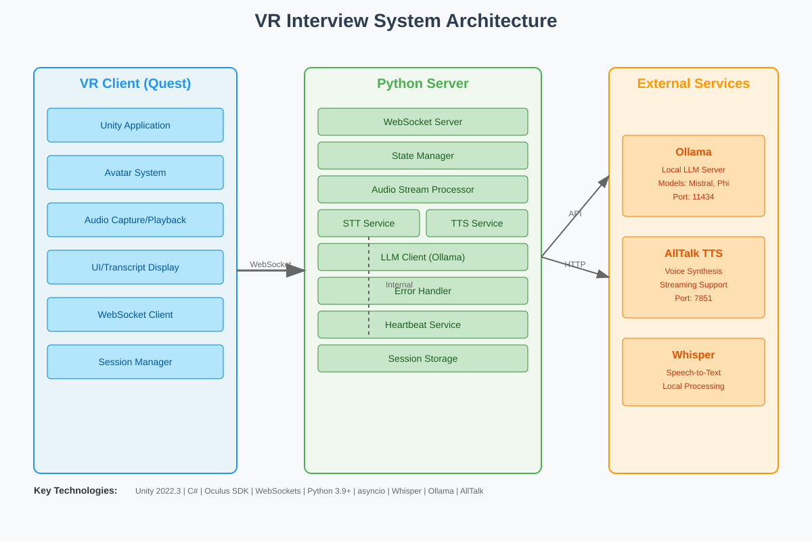
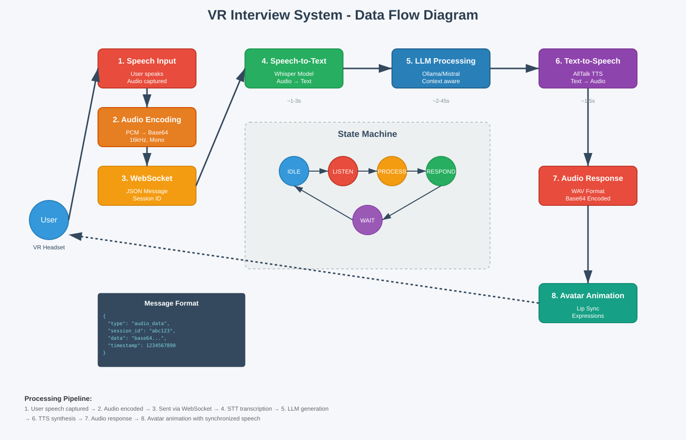

# VR Interview System Architecture

## Overview

The VR Interview System is an AI-powered virtual reality platform designed to help users practice job interviews in a realistic, immersive environment. The system combines cutting-edge VR technology with local AI processing to create a natural, conversational interview experience.

## Key Components

### 1. VR Client (Unity/Oculus Quest)
- **Unity Application**: Built with Unity 2022.3 for Oculus Quest
- **Avatar System**: Realistic interviewer with synchronized lip movements and facial expressions
- **Audio Management**: Real-time audio capture and playback
- **UI System**: Transcript display and status indicators
- **WebSocket Client**: Maintains persistent connection with server
- **Session Manager**: Handles conversation context and state

### 2. Python Server
- **WebSocket Server**: Handles real-time bidirectional communication
- **State Manager**: Controls conversation flow through defined states
- **Audio Stream Processor**: Manages the audio processing pipeline
- **STT Service**: Speech-to-text using Whisper models
- **TTS Service**: Text-to-speech using AllTalk with fallback options
- **LLM Client**: Interfaces with Ollama for natural language generation
- **Error Handler**: Robust error recovery and graceful degradation
- **Heartbeat Service**: Maintains connection during long operations

### 3. External Services
- **Ollama**: Local LLM server running models like Mistral or Phi
- **AllTalk TTS**: High-quality voice synthesis with streaming support
- **Whisper**: OpenAI's speech recognition model (integrated into Python server)

## Data Flow

The system follows this data flow:

1. **Speech Input**: User speaks in VR headset
2. **Audio Encoding**: Audio captured and encoded as base64
3. **WebSocket Transport**: JSON message sent to server
4. **Speech-to-Text**: Whisper transcribes audio to text
5. **LLM Processing**: Ollama generates contextual response
6. **Text-to-Speech**: AllTalk converts text to audio
7. **Audio Response**: Audio sent back to client
8. **Avatar Animation**: Lip sync and expressions synchronized

## State Machine

The conversation flow is managed by a robust state machine:

- **IDLE**: Initial state, ready for conversation
- **LISTENING**: Receiving and recording user audio
- **PROCESSING**: Three sub-states for STT, LLM, and TTS processing
- **RESPONDING**: Sending audio response to client
- **WAITING**: Ready for next user input
- **ERROR**: Error recovery state with fallback mechanisms

## Key Features

### Real-time Processing
- Sub-3 second speech-to-text transcription
- 2-45 second LLM response generation (context-dependent)
- 1-5 second text-to-speech synthesis
- Continuous heartbeat to maintain connection

### Robust Error Handling
- Automatic fallback from AllTalk to gTTS
- Graceful degradation for network issues
- Session recovery after disconnections
- Pattern-based error detection

### Natural Interaction
- Context-aware responses
- Professional interviewer personality
- Realistic avatar animations
- Voice activity detection

### Local Processing
- No cloud dependencies
- Privacy-focused design
- Low latency responses
- Offline capability

## Technical Stack

### Frontend (VR Client)
- Unity 2022.3 LTS
- C# with async/await patterns
- Oculus SDK for Quest
- XR Interaction Toolkit
- WebSocket Sharp for networking

### Backend (Python Server)
- Python 3.9+ with asyncio
- WebSockets for real-time communication
- Whisper for speech recognition
- Custom integration layers for services
- Thread pools for CPU-intensive tasks

### AI/ML Components
- Ollama for local LLM hosting
- Mistral/Phi models for conversation
- Whisper medium model for STT
- AllTalk for high-quality TTS

## Use Cases

1. **Job Interview Practice**: Realistic interview scenarios with AI interviewer
2. **Communication Skills**: Improve speaking and listening skills
3. **Confidence Building**: Safe environment to practice responses
4. **Language Learning**: Practice professional English
5. **Assessment Tool**: Evaluate interview performance

## Future Enhancements

- Multiple interviewer personalities
- Industry-specific interview scenarios
- Performance analytics and feedback
- Multi-language support
- Cloud deployment option
- Mobile VR support

This system represents a convergence of VR, AI, and real-time processing technologies to create an immersive learning experience that's both powerful and accessible.